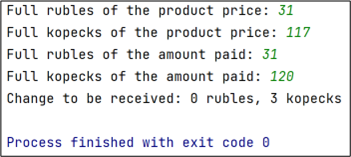
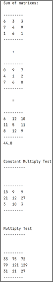
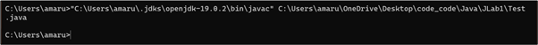
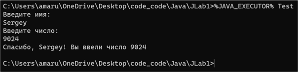

<style>
    body {
        font-family: 'Times New Roman', serif;
        font-size: 14pt;
        line-height: 1.5;
        text-align: justify;
    }

    h1, h3, h4 {
        font-size: 14pt;
        font-weight: 800;
        border-bottom: none;
        text-indent: 1.25cm;
        line-height: 1.5;
    }
    p {
        text-indent: 1.25cm;
        line-height: 1.5;
    }

    h2{ 
        font-size: 14pt;
        font-weight: 800;
        text-align: center;
        line-height: 1.5;
    }

    ul.toc {
        list-style: none;
    }

    li:before {
        white-space: nowrap;
        float: left;
        width: 0;
    }

    li.toc {
        clear: both;
    }

    ul.toc span + span {
        float: right;
        padding-left: 0.33em;
    }

    ul.toc span:first-child {
        padding-right: 0.33em;
    }

    .dot-leader {
    /* Center the content */
    display: flex;
    justify-content: center;
}

    .dot-leader__dots {
    /* Bottom border */
    border-bottom: 3px dotted #000;

    /* Take remaining width */
    flex: 1;

    /* Spacing */
    margin: 0.5rem;
}

code {
    font-size: 12px;
}

img {
    display: block;
    margin-left: auto;
    margin-right:auto;
}

</style>

$$
\begin{gather*} 
\Large{ГУАП} \\ ФАКУЛЬТЕТ\ СРЕДНЕГО\ ПРОФЕССИОНАЛЬНОГО\  ОБРАЗОВАНИЯ\end{gather*}\\\ \\\ \\\ \\\ 
\begin{matrix} 
    \begin{aligned}
    &\text{ОТЧЁТ} & & & & & & & & & & & & & & & & & & & & & & & & & & & & & & & & & & & & & & & &  \\
    &\text{ЗАЩИЩЁН С ОЦЕНКОЙ}\\
    &\text{ПРЕПОДАВАТЕЛЬ}
    \end{aligned}
 \end{matrix} \\\ \\\ \\\
{ \text{преподаватель} \above{1pt} \text{должность,\ уч.\ степень,\ звание} } \quad {\above{1pt} подпись,\ дата} \quad {\text{И. А. Юрьева} \above{1pt} инициалы,\ фамилия} \\\ \\\ \\\ \\\ \\\ \\\ \text{ОТЧЁТЫ О ЛАБОРАТОРНЫХ РАБОТАХ} \\\ \\\ \\\ \\\ \text{по дисциплине: МДК 01.01} \\\ \\\ \\\ \\\ 

\begin{matrix} 
    \begin{aligned}
    &\text{РАБОТУ ВЫПОЛНИЛ} & & & & & & & & & & & & & & & & & & & & & & & & & & & & & & & & & & & & & & & &  \\
    &\text{СТУДЕНТ ГР. №}
    \end{aligned}
 \end{matrix}\\\ \\\
 \begin{gather*}
 { \text{С021}\above{1pt} \quad \quad \quad \quad \quad \quad } \quad {\above{1pt} \text{подпись, дата}} \quad {\text{С. С. Гамуйло} \above{1pt} \text{инициалы, фамилия}}
 \end{gather*}
$$
<div style="page-break-after: always;"></div>

## СОДЕРЖАНИЕ
<div class="dot-leader">
    <span>Лабораторная работа №1</span>
    <div class="dot-leader__dots"></div>
    <span>3</span>
</div>

<div style="page-break-after: always;"></div>

## Лабораторная работа №1
**Тема:** Работа с потоками ввода-вывода. Создание классов в Java. Запуск приложения из командной строки.

**Цель работы:** получение практических навыков при создании классов и запуске приложений в командной строке.

**Задание 3.** Создать приложение, в котором для товара стоимостью a руб. b коп. при оплате за него c руб. d коп. вычисляется, сколько сдачи требуется получить.

Код программы:

```java
import java.util.Scanner;

public class Main {
    public static void main(String[] args) {
        Scanner scanner = new Scanner(System.in);

        // Ввод всего необходимого для работы
        System.out.print("Full rubles of the product price: ");
        int a = scanner.nextInt();

        System.out.print("Full kopecks of the product price: ");
        int b = scanner.nextInt();

        System.out.print("Full rubles of the amount paid: ");
        int c = scanner.nextInt();

        System.out.print("Full kopecks of the amount paid: ");
        int d = scanner.nextInt();

        // Расчет полной стоимости и сделанной оплаты в копейках: конвертация
        int priceInKopecks = a * 100 + b;
        int amountPaidInKopecks = c * 100 + d;

        // Полная сдача в копейках
        int changeInKopecks = amountPaidInKopecks - priceInKopecks;

        // За счёт автоматического отбрасывания int'ом вещественной части,
        // просто делим на сотню и получаем цену в рублях без копеек.
        int rublesChange = changeInKopecks / 100;
        // Берем остаток от деления, то бишь наша копеечная часть
        int kopecksChange = changeInKopecks % 100;


        System.out.println("Change to be received: " + rublesChange + " rubles, " + kopecksChange + " kopecks");
    }
}
```


<div style="text-align: center;">Рисунок 1 - Результат работы программы №1</div>

<br>

**Задание 4.** Создать собственный класс (классы) в соответствии с вариантом, полученным в лабораторной работе по С# (Создание классов).

**Индивидуальный вариант:** 10 вариант


<br>

Код программы №2:

(SquareMatrix-класс и его методы)

```java
import java.util.ArrayList;
import java.util.Arrays;
import java.util.Random;
import java.lang.Math.*;
import java.util.stream.Collectors;

public class SquareMatrix {
    private int size;
    private ArrayList<ArrayList<Integer>> values = new ArrayList<>();
    public int getSize() {
        return size;
    }
    public void setSize(int size) throws Exception {
        if (this.size <= 0)
        {
            throw new Exception("ERROR: Size should be greater than 0.");
        }
        this.size = size;
    }
    public ArrayList<ArrayList<Integer>> getValues() {
        return values;
    }
    public void setValues(ArrayList<ArrayList<Integer>> values) throws Exception {
        if (this.values.size() != getSize() || this.values.get(0).size() != getSize())
        {
            throw new Exception("ERROR: Incorrect input");
        }
        this.values = values;
    }

    public SquareMatrix(int size, ArrayList<ArrayList<Integer>> values) { this.size = size; this.values = values; }
    public SquareMatrix(int size)
    {
        this.size = size;
        var values = new ArrayList<ArrayList<Integer>>();
        for (int i = 0; i < size; i++)
        {
            values.add(new ArrayList<Integer>());
            for (int j = 0; j < size; j++)
            {
                var rand = new Random();
                values.get(i).add(rand.nextInt(0, 10));
            }
        }
        this.values = values;
    }

    public String ToString()
    {
        StringBuilder matrixStr = new StringBuilder("\n");
        matrixStr.append("---".repeat(getSize()));
        for (var list: values) {
            matrixStr.append('\n').append(list.stream().map(Object::toString).collect(Collectors.joining("\t")));
        }
        matrixStr.append("\n").append("---".repeat(getSize()));
        return matrixStr.toString();
    }

    public SquareMatrix Plus(SquareMatrix operand) throws Exception
    {
        SquareMatrix initial = new SquareMatrix(operand.getSize());
        if (this.getSize() != operand.getSize()) throw new Exception("ERROR: Incorrect size of operands");

        for (int i = 0; i < this.getSize(); i++) {
            for (int j = 0; j < this.getSize(); j++) {
                initial.getValues().get(i).set(j, this.getValues().get(i).get(j) + operand.getValues().get(i).get(j));
            }
        }

        return initial;
    }

    public SquareMatrix Minus(SquareMatrix operand) throws Exception
    {
        SquareMatrix initial = new SquareMatrix(operand.getSize());
        if (this.getSize() != operand.getSize()) throw new Exception("ERROR: Incorrect size of operands");

        for (int i = 0; i < this.getSize(); i++) {
            for (int j = 0; j < this.getSize(); j++) {
                initial.getValues().get(i).set(j, this.getValues().get(i).get(j) - operand.getValues().get(i).get(j));
            }
        }

        return initial;
    }

    public SquareMatrix MultiplyConstant(int constant) throws Exception
    {
        SquareMatrix initial = new SquareMatrix(this.getSize());
        if (this.getSize() != this.getSize()) throw new Exception("ERROR: Incorrect size of operands");

        for (int i = 0; i < this.getSize(); i++) {
            for (int j = 0; j < this.getSize(); j++) {
                initial.getValues().get(i).set(j, this.getValues().get(i).get(j) * constant);
            }
        }

        return initial;
    }

    public SquareMatrix Multiply(SquareMatrix operand) throws Exception {
        if (this.getSize() != this.getSize()) throw new Exception("ERROR: Incorrect size of operands");
        var initial = new SquareMatrix(this.getSize());
        for (int i = 0; i < this.getSize(); i++) {
            for (int j = 0; j < this.getSize(); j++) {
                int val = 0;
                for (int z = 0; z < this.getSize(); z++) {
                    val += this.getValues().get(i).get(z) * operand.getValues().get(z).get(j);
                }

                initial.getValues().get(i).set(j, val);
            }
        }
        return initial;
    }

    public double MatrixSum()
    {
        int sum = 0;
        for (int indexX = 0; indexX < this.getSize(); indexX++)
        {
            for (int indexY = 0; indexY < this.getSize(); indexY++)
            {
                sum += values.get(indexX).get(indexY);
            }
        }
        return sum;
    }

}
```

(Основная программа)

```java
import java.io.*;
public class MatrixTest {
    public static void main(String[] args) {
        SquareMatrix test = new SquareMatrix(3);
        SquareMatrix testOperand = new SquareMatrix(3);
        System.out.println("Sum of matrixes:");
        System.out.println(test.ToString() + "\n\n\t+");
        System.out.println(testOperand.ToString());
        System.out.println("\n\t=");
        try {
            System.out.println(test.Plus(testOperand).ToString());
        } catch (Exception e) {
            throw new RuntimeException(e);
        }
        System.out.println(testOperand.MatrixSum());
        System.out.println("\n\nConstant Multiply Test\n----------\n");
        try {
            System.out.println(test.MultiplyConstant(3).ToString());
        } catch (Exception e) {
            throw new RuntimeException(e);
        }
        System.out.println("\n\nMultiply Test\n----------\n");
        try {
            System.out.println(test.Multiply(testOperand).ToString());
        } catch (Exception e) {
            throw new RuntimeException(e);
        }
    }
}
```


<div style="text-align: center;">Рисунок 2 - Результат работы программы №2</div>

<br>

**Задание 5.** Выполнить компиляцию и запуск приложения Java с помощью командной строки.

<br>


<div style="text-align: center;">Рисунок 3 - Выполненные команды компиляции</div>

<br>


<div style="text-align: center;">Рисунок 4 - Скомпилированный файл .class</div>

<br>


<div style="text-align: center;">Рисунок 5 - Запуск скомпилированного файла</div>