$$
\Large{\text{ГУАП}} \\
\text{ФАКУЛЬТЕТ СРЕДНЕГО ПРОФЕССИОНАЛЬНОГО ОБРАЗОВАНИЯ} \\ \\ \\
\begin{aligned}
&\text{ОТЧЁТ} & & & & & & & & & & & & & & & & & \\
&\text{ЗАЩИЩЁН С ОЦЕНКОЙ}\\
&\text{ПРЕПОДАВАТЕЛЬ}
\end{aligned} \\ \\ 
{\text{преподаватель} \above{1px} \text{должность, уч. степень, звание} } \quad {\above{1px} \text{подпись, дата}} \quad { \text{И. А. Юрьева}\above{1px} \text{инициалы, фамилия}} \\ \\ \\ \\
\text{ОТЧЁТЫ О ЛАБОРАТОРНЫХ РАБОТАХ} \\ \\
\text{по дисциплине: МДК 04.01} \\ \\
\begin{aligned}
&\text{РАБОТУ ВЫПОЛНИЛ} & & & & & & & & & & & & & & & & & & \\
&\text{СТУДЕНТ ГР. №}
\end{aligned} \\
{ \text{С021}\above{1px} \quad \quad \quad \quad \quad \quad } \quad {\above{1px} \text{подпись, дата}} \quad { \text{С. С. Гамуйло} \above{1px} \text{инициалы, фамилия}}
$$

<div style="page-break-after: always;"></div>

## СОДЕРЖАНИЕ

<div class="dot-leader">
    <span>Лабораторная работа №3</span>
    <div class="dot-leader__dots"></div>
    <span>3</span>
</div>
<div style="page-break-after: always;"></div>

<div style="page-break-after: always;"></div>

## Лабораторная работа №3

**Тема:** Создание хранимых процедур и функций в MySQL Workbench. Методы защиты баз данных. 

**Цель работы:** получение практических навыков при создании и использовании хранимых процедур и функций.


**Самостоятельная работа**

**Задание 1.** Создайте хранимую процедуру с параметром для выполнения следующего запроса.

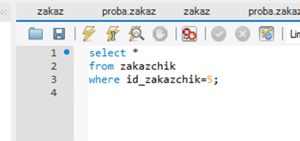


Код процедуры

```sql
create procedure `request_id`(customer int)
begin
    select *
        from customer
            where customer.customer_id = customer;
end;
```


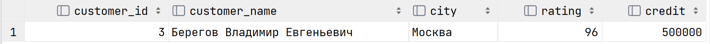

<div class="counter">Результат работы первой процедуры (id=3)</div>


**Задание 2.** Создайте хранимую процедуру с параметрами для выполнения следующего запроса.

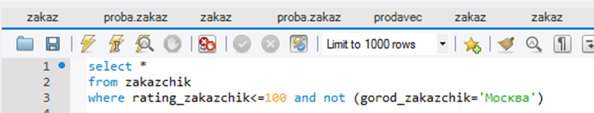


Код процедуры

```sql
create procedure `request_city_rating`(rate int, city_not varchar(50))
begin
    select *
        from customer
            where rating <= rate and not(city = city_not);
end;
```


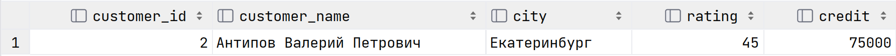

<div class="counter">Результат работы процедуры (Не Москва и рейтинг не выше 50)</div>


**Задание 3.** Создайте хранимую процедуру с параметрами для выполнения следующего запроса.

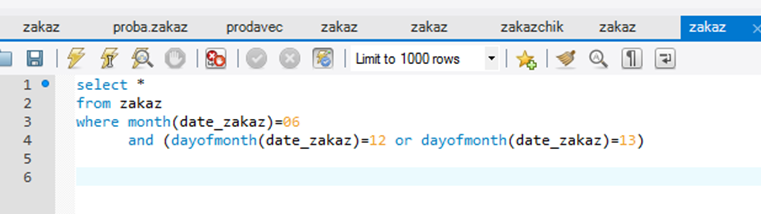


Код процедуры

```sql
create procedure `request_date`(date date)
begin
    select *
        from `order`
            where month(order_date) = month(date)
    and(dayofmonth(order_date) = dayofmonth(date) or dayofmonth(order_date) = dayofmonth(date) + 1);
end;
```


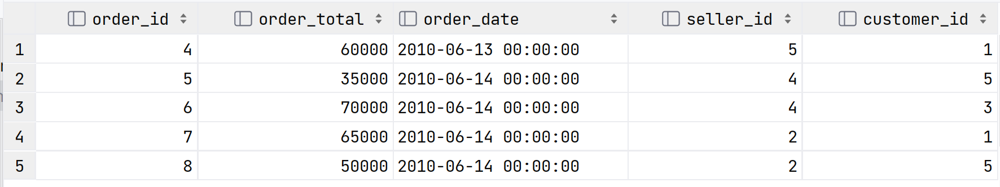

<div class="counter">Результат работы процедуры (дата 2010-06-13)</div>


**Задание 4.** Создайте хранимую процедуру с параметром, которая в зависимости от параметра находит наименьшую или наибольшую сумму для каждого заказчика. 

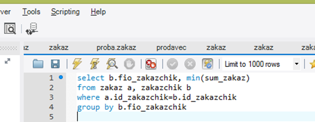


Код процедуры

```sql
create procedure `min_or_max_request`(minmax bool)
begin
    if(minmax) then select customer.customer_name, min(order_total)
            from customer, `order`
                where `order`.customer_id = customer.customer_id;
        else select customer.customer_name, max(order_total)
                from customer, `order`
                    where `order`.customer_id = customer.customer_id;
    end if;
end;
```


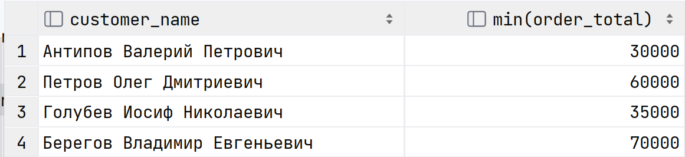

<div class="counter">Результат работы процедуры (параметр = 1) (минимально)</div>


**Задание 5.**  Создайте хранимую процедуру с параметром для выполнения следующего запроса.

```sql
update prodavec
set comis_prod=comis_prod*1.2
where plan_prod>300
```


Код процедуры

```sql
create
    definer = root@localhost procedure update_seller(IN sales int, IN multiply double)
begin
    update seller
    set commission = commission * multiply
    where sales_plan > sales;
end;
```


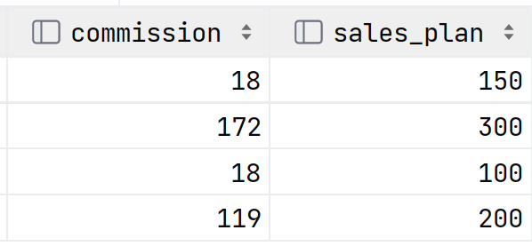

<div class="counter">Результат работы процедуры (вторая и третья строки умножились на 3.5)</div>


**Задание 6.** Создайте хранимую процедуру с параметром для выполнения следующего запроса.


Код процедуры

```sql
create
    definer = root@localhost procedure delete_order(IN name varchar(100))
begin
    delete from `order`
        where customer_id = (select customer_id
                             from customer
                             where customer_name = name);
end;
```


**Индивидуальное задание**

**Процедура 1.** Получить всех пассажиров всех рейсов определенной даты

Код процедуры

```sql
create procedure getFlightsByDate(date date)
begin
    select f.flightCode, f.date, f.from, f.to, a.brand, a.capacity, a.load, t.passFirstName, t.passSecondName, t.passMiddleName, t.price, t.place
    from flights f
    join aircrafts a on f.aircraftCode = a.aircraftCode
    join tickets t on f.flightCode = t.flightCode
    where YEAR(f.date) = YEAR(date) and MONTH(f.date) = MONTH(date) and DAYOFMONTH(f.date);
end;
```


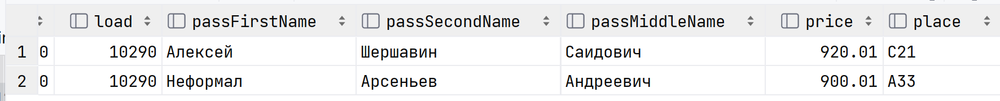

<div class="counter">Результат работы с датой 2020-12-03</div>


**Процедура 2.** Получить всех сотрудников на конкретной должности

Код процедуры

```sql
create procedure getEmployeesByJobTitle(jobTitle varchar(50))
begin
    select e.empCode, e.firstName, e.secondName, e.middleName, e.birthDate, e.sex, e.homeAddress, e.phoneNumber, e.passportDetails, j.title as jobTitle, c.crewCode
    from employee e
    join jobs j on e.jobCode = j.jobCode
    left join crewemployees c on e.empCode = c.crewMember
    where j.title = jobTitle;
end;
```


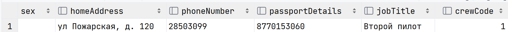

<div class="counter">Результат с параметром Второй пилот</div>


**Процедура 3.** Обновить дату последнего обслуживания по коду самолета

Код процедуры

```sql
create procedure updateAircraftReleaseDate(acCode int, lastService date)
begin
    update aircrafts
        set lastServiceDate = lastService
    where aircraftCode = acCode;
end;
```


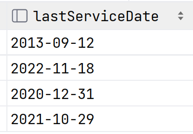

<div class="counter">Результат работы - с 2019 на 2020 год</div>


**Процедура 4.** Удалить всю информацию о самолете из всех таблиц с помощью транзакции

Код процедуры

```sql
create
    definer = root@localhost procedure deleteAircraft(IN acCode int)
begin
    start transaction;

    delete from flights where aircraftCode = acCode;

    delete from tickets where flightCode in (select flightCode from flights where aircraftCode = acCode);

    delete from aircrafts where aircraftCode = acCode;

    if (select row_count()) = 0 then
        rollback;
    else
        commit;
    end if;
end;
```


**Процедура 5.** Добавить нового сотрудника	

Код процедуры

```sql
create
    definer = root@localhost procedure insertEmployee(IN empCode1 int, IN firstName1 varchar(50), IN secondName1 varchar(50), IN middleName1 varchar(50), IN birthDate1 date, IN sex1 char, IN homeAddress1 varchar(100), IN phoneNumber1 varchar(20), IN passportDetails1 varchar(50), IN jobCode1 int)
begin
    insert into employee values(empCode1, firstName1,
                                secondName1, middleName1,
                                birthDate1, sex1,
                                homeAddress1, phoneNumber1,
                                passportDetails1, jobCode1);
end;
```


**Представление 1.** Создать вид всей информации о самолете прикрепленном к конкретному рейсу

Код представления

```sql
create view flightDetails as
    SELECT flights.*, aircrafttypes.title AS aircraftType, aircrafttypes.restrictions AS aircraftRestrictions
FROM flights
JOIN aircrafts ON flights.aircraftCode = aircrafts.aircraftCode
JOIN aircrafttypes ON aircrafts.typeCode = aircrafttypes.typeCode;
```


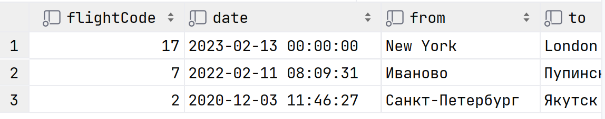

<div class="counter">Результат работы запроса</div>


**Представление 2.** Отобразить информацию о том, сколько налетано часов у каждого типа самолетов

Код представления

```sql
CREATE VIEW aircraft_type_hours AS
SELECT aircrafttypes.title AS aircraftType, SUM(aircrafts.hoursFlown) AS totalHoursFlown
FROM aircrafts
JOIN aircrafttypes ON aircrafts.typeCode = aircrafttypes.typeCode
GROUP BY aircrafttypes.title;
```


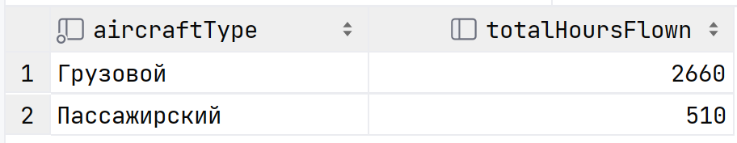

<div class="counter">Результат работы запроса</div>

